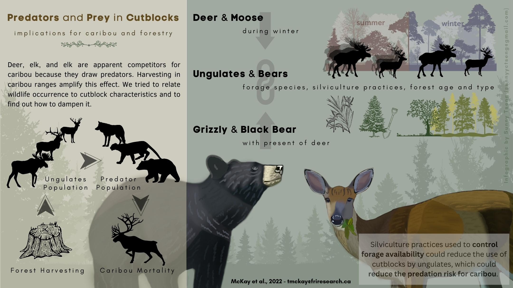

# A diagram for the thinning operations on ungulate forest management

## About

The paper is entitled "Can Thinning Operations be used as a form of Ungulate-Adapted Forest Management? A Mini-Review and Primer". The goal of this project is to create a diagram to summarize the findings and ideas of this paper. 

- [Article](/docs/thinning_operation.docx)

- [Example figures](/docs/IMG_0412.JPG)

## Time line

| Deliverable | Due | Review |
| ----------- | ------------- | ------ |
| Content and relevant info | Oct.31 | agree on the draft |
| Visual design |Nov.10 |  |
| Text design | Nov.16 |  |
| First product | Nov.17 | review of the product |
| Revision(s) | Nov.20|  |

## Tools

I will be using these two platforms for designing: 

- [GIMP](https://www.gimp.org/): an image editor for most of the visual design, including digital drawing.

- [Canva](https://www.canva.com/): a design tool for presentations and social media. I will be using canva for the text design. 

Example of my design style. Visit website for more: https://sunshineland.netlify.app/infographic/

## Expected output

- Dimension: 1920x1080 pixel
- Orientation: Horizental
- File type: PNG, JPEG, PDF

## Expected compensation

Between \$800 - \$890, with around 30-35 working hours expected for the work 

| Hours | Task |
| --- | --- |
| 4 | materials and infomation collection |
| 5 | communication |
| 12 | visual design |
| 4 | text design |
| 3 | review and final editing of the work |
| 2 | others |

## References

- [FUSE consulting company](https://www.fuseconsulting.ca/infographics)
- [FRI research](https://friresearch.ca/search/?frisearchable_posts%5BhierarchicalMenu%5D%5Btaxonomies_hierarchical.publication_type.lvl0%5D%5B0%5D=Summaries%20and%20Communications&frisearchable_posts%5BhierarchicalMenu%5D%5Btaxonomies_hierarchical.publication_type.lvl0%5D%5B1%5D=Infographics)

